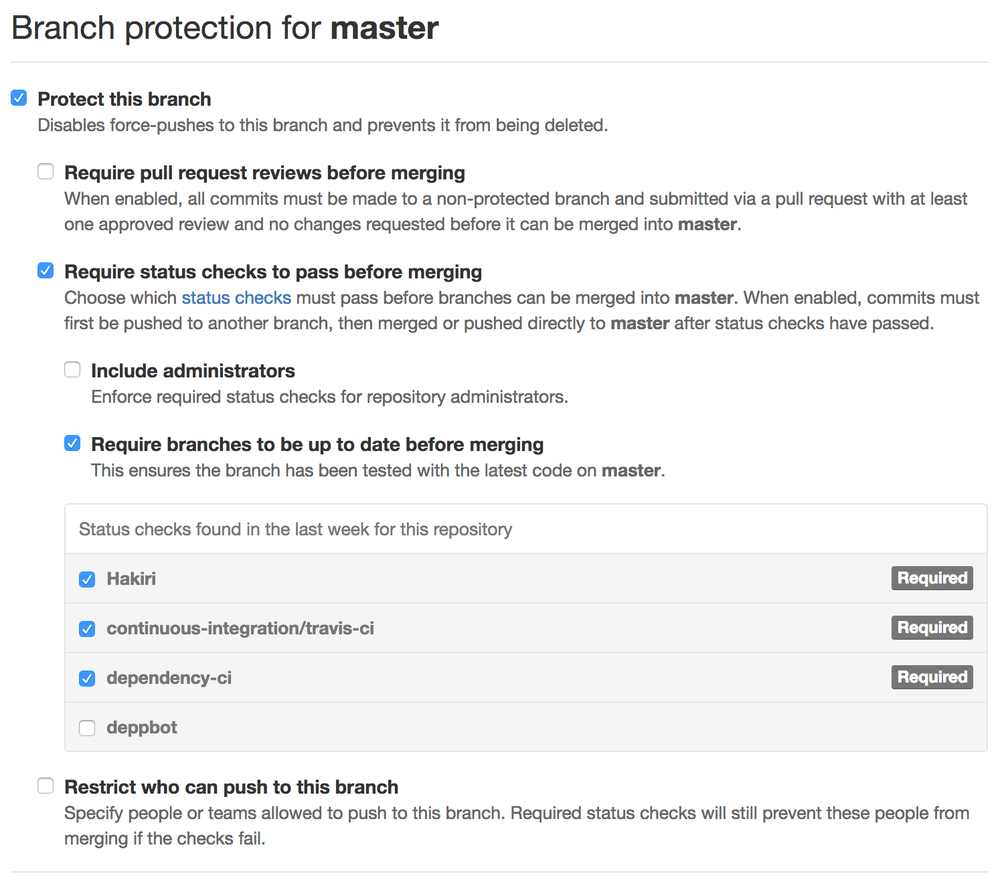
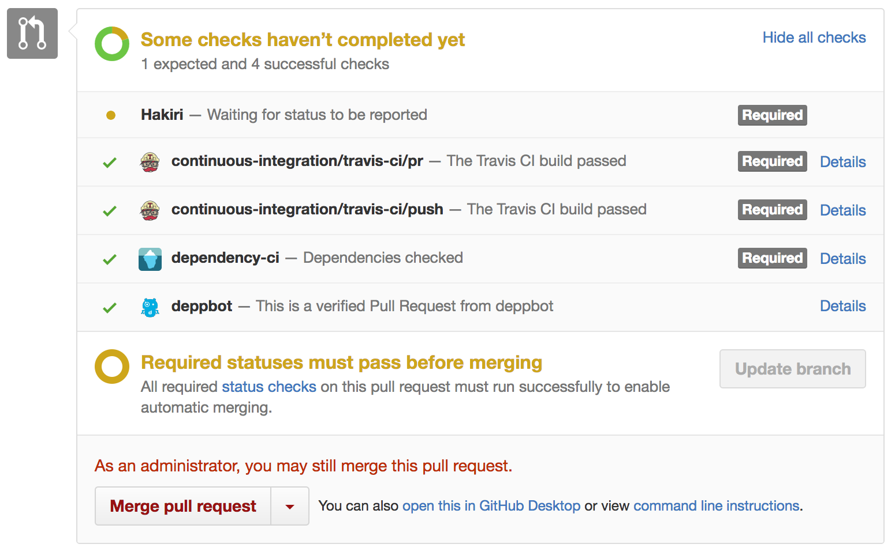

# Continuous Integration for Ruby based projects

> Continuous Integration (CI) is a development practice that requires developers to integrate code into a shared repository several times a day. Each check-in is then verified by an automated build, allowing teams to detect problems early.
>
> [ThoughtWorks](https://www.thoughtworks.com/continuous-integration)

This guide covers the typical CI pipeline for ruby based projects. It is assumed your project is open and hosted on GitHub.

- [GitHub setup](#github-setup)
- [Pull requests](#pull-requests)
- [Jenkins](jenkins)

## GitHub setup

Having created your repo, and pushed your first commit ensure the following services are hooked in:

- [Travis CI](https://travis-ci.org/)
- [Code Climate](https://codeclimate.com)
- [Hakiri](https://hakiri.io/)

If your project checks in both the `Gemfile` and `Gemfile.lock` (so not applicable to [gems](http://guides.rubygems.org/what-is-a-gem/)) you should also hook in:

- [Dependabot](https://dependabot.com/)

Configure **Dependabot** to enable `Only lockfile updates`.

Ensure that your main branches (**master** and **develop**) are [protected](https://help.github.com/articles/about-protected-branches/) and the following options are selected

- Require status checks to pass before merging
- Require branches to be up to date before merging
- Set the **Hakiri** status check as required
- Set the **Dependency CI** status check as required
- Set the **Travis CI** status check as required

### Additional actions

To hook up **Travis CI** and **Code Climate** you'll need to add config files for each service to your project. See existing projects for examples:

- [Journea](https://github.com/DEFRA/journea)
- [Flood risk front office (FRAE)](https://github.com/DEFRA/flood-risk-front-office)

The key thing to note is that **Travis CI** can be configured to send test coverage metrics to **CodeClimate**.

N.B. *It's noted that providing an actual template for each file and detailed instructions on how to configure these services would be beneficial. This info will come in subsequent updates.*

## Pull requests

Once your project is hooked up when you push to the repo these checks will automatically fire. This will be most visible in the pull request.

You should now be in a position that you can only merge into your main branches if:

- the project builds, including all tests passing
- there are no security issues with your dependencies
- there are no security issues with your code

The **Code Climate** integration won't block a merge, but will allow you to track code quality, test coverage, and whether there are additional issues in the code.

## Jenkins

This section covers our internal build servers, and the typical setup for a ruby based project.

Only front end applications that require deployment need hooking into our **Jenkins** environment. So for example the [FRAE front office](https://github.com/DEFRA/flood-risk-front-office) and [back office](https://github.com/DEFRA/flood-risk-back-office) are built by **Jenkins**, but the [engine](https://github.com/DEFRA/flood-risk-engine) isn't.

Each digital service will come with 4 environments:

- development
- QA
- pre-production
- production

The intention is to provide a second level of CI, ensuring that your project will deploy successfully and work within its prepared environment.

Deployments to **development** are automatic. To **QA** and **pre-production** they are can be manually triggered by any member of the team. Deployments to **production** can only be triggered by authorised individuals.

### Projects

For each front end element of your service you will need to create a series of [projects](https://jenkins.io/doc/book/glossary/#project) (sometimes referred to as [jobs](https://jenkins.io/doc/book/glossary/)). For example both the FRAE and WEX services have 2; a front and back office application.

You will need the following projects, in this order in each environment, for each front end:

- **changes** (development only)
  - polls GitHub looking for changes. If found it will automatically fire the **push hosts** job, so you can check your change has not broken deployment
- **push hosts**
  - Updates the local `hosts` file with the IP addresses of the servers within the environment
- **deploy**
  - Pulls down your Capistrano deployment project from our internal GitLab instance, and deploys the project to the app servers
- **restart**
  - Currently a restart of passenger is required following a new deployment to ensure it is pointing to the latest version of the code
- **acceptance tests** (non-production only)
  - Each digital service is expected to have a suite of acceptance tests managed by the QA & Test member of the team. These are intended to check both the application and the environment are working as expected

These should be configured to be dependent, so that when one job completes the next is fired automatically.

This does mean creating a lot of projects, but the good news is **Jenkins** has the ability to copy from existing ones. Refer to existing ones for examples on how to configure you're own.
