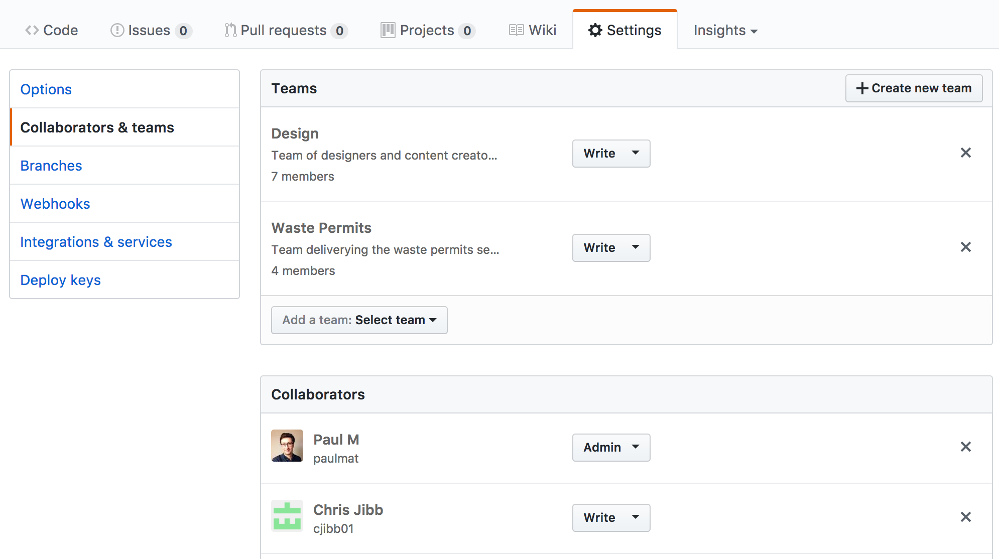

# GitHub

This guide covers covers all things related to accessing and using [GitHub](https://github.com) in the context of working on a Defra project.

- [New projects](new_projects.md)

## GitHub account requirements

Before you can do anything on GitHub you'll need to [create an account](https://github.com/join). If you already have one it is okay to use it, else create a new one specifically for your Defra work if you prefer.

Whether you create an account or use an existing one, it must meet the following requirements

- [Two factor authentication](https://help.github.com/articles/about-two-factor-authentication/) must be enabled
- Your profile must have the `Name` field populated with your full name .e.g. *Alan Cruikshanks*.

You're not required to set a profile picture, but changing it from the default GitHub provides will help your team members distinguish your contributions from theirs.

## Joining the Defra organisation

All projects at Defra must be created under the [Defra organisation](https://github.com/DEFRA). If you are a permanent member of Defra staff we will add you to it. Else if a contractor or working on behalf of a supplier we will add you as a [collaborator](https://help.github.com/articles/adding-outside-collaborators-to-repositories-in-your-organization/) on the specific projects you need.

Contact [Alan Cruikshanks](https://github.com/Cruikshanks) or [David Blackburn](https://github.com/davidblackburn) to request being added.

### Existing members who are contractors

Some existing members of the Defra organisation are contractors. This decision came after we had been using GitHub for sometime. For fear of breaking any existing services we have left these members as is. Only new contractors and suppliers will be affected by this decision.

## Team setup

With some exceptions teams should match to services / projects.

The aim is to help new and existing users identify who is working on what services, should they need to make contact.

The exceptions are teams like [Design](https://github.com/orgs/DEFRA/teams/design/members) and [Maintainers](https://github.com/orgs/DEFRA/teams/maintainers/members), who have a cross service purpose.

### Joining a team

All members of the Defra organisation should be able to see [all our teams](https://github.com/orgs/DEFRA/teams). If there is a team applicable to you e.g. **Design**, or you are to begin working on a service you will need to contact the team's maintainer to ask to join it.

Select the team to see its list of members and who its maintainer(s) is.

### Creating a new team

If you need a new team contact any member of the [Maintainers](https://github.com/orgs/DEFRA/teams/maintainers/members) team. They will need

- The name of the service / project (please avoid acronyms to help support new users)
- A description (one sentence long)
- Username of the team maintainer
- A list of repositories the team requires access to

Once created it will then be up to the maintainer to [add new members](https://help.github.com/articles/adding-organization-members-to-a-team/) to the team.

### Being a team maintainer

As a team maintainer you are responsible for ensuring that the members of your team and the repositories you have access to are accurate.

Not only is this important from a security perspective, but the 'teams' list is an important source of information for other users.

## Repositories

Repositories are where we actually store our content (mainly code) on GitHub. All members of the Defra organisation have *Read* access to all repositories, both public and private.

### Create a new repo

The [New projects](new_projects.md) guide covers what you need to do to create a new repo or 'project'.

### Collaborators & teams

This refers to a tab in the `Settings` area of a repo. Its here you control which teams have **write** access to the repository.

Teams should only ever be given write access

- All members have *Read* access so granting a team this is meaningless
- Teams represent all members of a service, however not all of them should have *Admin* access

The administrator for each repo will be added as a **Collaborator**. Using GitHub's available functionality this is seen as the best solution

- It avoids creating *Admin only* teams for each service
- It helps distinguish who is the administrator for a repository

Also added as *Collaborators* will be any contractors or suppliers who require access to the repo. There access should be set to either *Read* or *Write*. Only if the repo is being maintained by a third party, such as a supplier will a collaborator be given *Admin* access.

### Being an repository admin

If you are the administrator for a repository its your responsibility to ensure the repo has been setup and maintained in accordance with [New projects](new_projects.md) guide.

It is also on you to ensure **Collaborators & teams** reflects who should have access to the repository.
