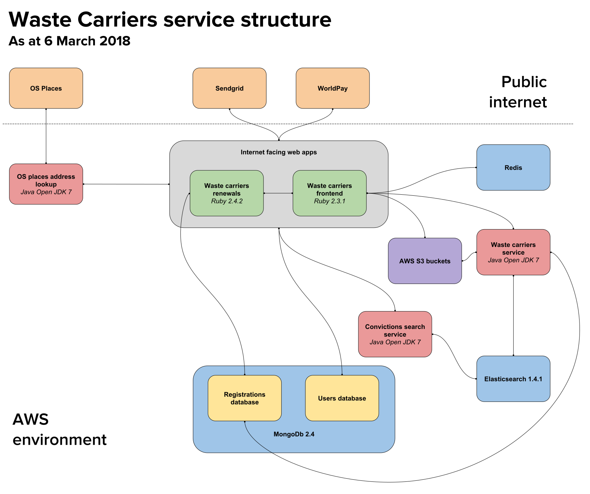

# Register as a Waste carrier

To quote the description on the main project README

> The Waste Carrier Registrations Service allows businesses, who deal with waste and thus have to register according to the regulations, to register online. Once registered, businesses can sign in again to edit their registrations if needed.
>
> The service also allows authorised agency users and NCCC contact centre staff to create and manage registrations on other users behalf, e.g. to support 'Assisted Digital' registrations. The service provides an internal user account management facility which allows authorised administrators to create and manage other agency user accounts.

The [start page](https://www.gov.uk/waste-carrier-or-broker-registration) for the service has more details about waste carrier registration in general.

## High level overview

The service is implemented as a frontend web application, with a service API and a document-oriented database (MongoDB) underneath.

The frontend application is a Ruby on Rails 4 application, which accesses a RESTful services layer implemented in Java. The services layer provides a RESTful API to manage (create, read, update, delete) registrations. The service layer in turn accesses a MongoDB database. It is built using the [Dropwizard](http://www.dropwizard.io/) framework.

For authentication purposes the service uses the [Devise gem](https://github.com/plataformatec/devise) to manage the user accounts of waste carriers (i.e. external users), and internal users (agency users such as NCCC contact centre staff and administrators). User account information managed by the Devise gem is stored in MongoDB, and the front end app accesses this directly.

There are a number of other components that make up the service that the team are expected to maintain and manage.

### Renewing a registration

From October 2017 to May 2018 the ability for users who registered or renewed after March 2015 to renew was being added to the service. The solution involves building a second external facing Ruby on Rails app which will communicate directly with the databases in MongoDb.

## Repositories

Currently the service is made up of the following repositories

- [Waste carriers frontend](https://github.com/DEFRA/waste-carriers-frontend) - Ruby on Rails frontend application

- [Waste carriers service](https://github.com/DEFRA/waste-carriers-service) - Java back end RESTful services layer

- [OS Places address lookup](https://github.com/DEFRA/os-places-address-lookup) - Java web app built using Dropwizard which provides a facade to the OS places API

- [Convictions search service](https://gitlab-dev.aws-int.defra.cloud/waste-carriers/convictions-search-service.git) - Java web app built using Dropwizard which is used to match details entered during the registration with lists of entities of interest

- [Waste carriers renewals](https://github.com/DEFRA/waste-carriers-renewals) - Ruby on Rails application built to support the renewal functionality

## Additional info

Most of the repositories above feature Wiki's that contain additional information about that element of the service.
