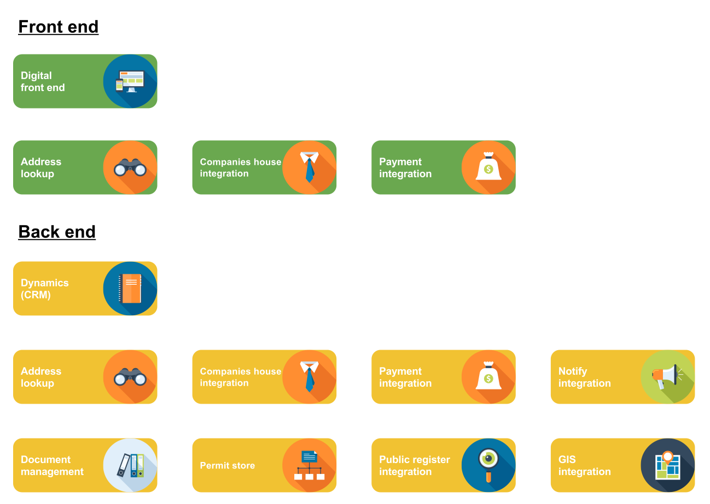

# Apply for a standard rules waste permit

To quote the description on the main project README

> You may need to apply to the Environment Agency for an environmental permit if your business uses, recycles, treats, stores or disposes of waste or mining waste. This permit can be for activities at one site or for mobile plant that can be used at many sites.
>
> The Waste Permits service will be a new, online way to apply for a waste permit.
>
> This service is currently beta and has been developed in accordance with the Digital by Default service standard, putting user needs first and delivered iteratively.

The guidance page [Standard rules: environmental permitting](https://www.gov.uk/government/collections/standard-rules-environmental-permitting) has more details about standard rules permits in general.

## High level overview

The service is made up of an external facing Node.js web app that users will use to complete and submit their applications.

This talks directly to a Microsoft Dynamics instance, which will be configured to manage the application and the details of the operator.

To improve the quality of the data submitted, the service will include integrations to an address lookup and Companies House. Also there is a charge to submit an application, and the service will allow users to make payments online.

A lot of this functionality has to be supported on the back end as well (hence the duplication) in order to support assisted digital applications. On top of that documents submitted during the application need to be stored, the permit itself and its conditions will be stored in a permit store, and integrations to additional systems used as part of approving an application are needed.

## Focus for developers

The primary focus of developers working on the team is the digital front end, and the integrations it uses.

Some integrations may already exist ([address lookup](https://github.com/DEFRA/ea-address-facade)), and some are intended to be built by another team (permit store).

Configuration and customisation of **Dynamics** is handled by an external provider, though their developers sit within the service team and both the front and back end developers closely collaborate to ensure the solution 'works'.

## Repositories

Currently the service is made up of the following repositories

- [Waste permits](https://github.com/DEFRA/waste-permits) - the repo for the front end

The QA and Test engineer manages the following

- [Waste permits acceptance tests](https://github.com/DEFRA/waste-permits-acceptance-tests) - acceptance tests for the front end
- [Waste permits dynamics acceptance tests](https://github.com/DEFRA/waste-permits-dynamics-acceptance-tests) - acceptance tests for **Dynamics**

Finally the back end team do most of their work in this repository

- [License and permitting Dynamics](https://github.com/DEFRA/license-and-permitting-dynamics) - the solution which manages configuration and customisation of **Dynamics**

There is also a [prototype](https://github.com/DEFRA/standard-waste-permit-prototype) which is managed by the designers, and the initial [proof of concept](https://github.com/DEFRA/waste-permits-handshake-poc) developed during alpha. However it is not expected developers on the team would have any engagement with these.

## Guides

 Additional guides are TBC. The service is still in the early stages of alpha and a release process is not yet agreed.
